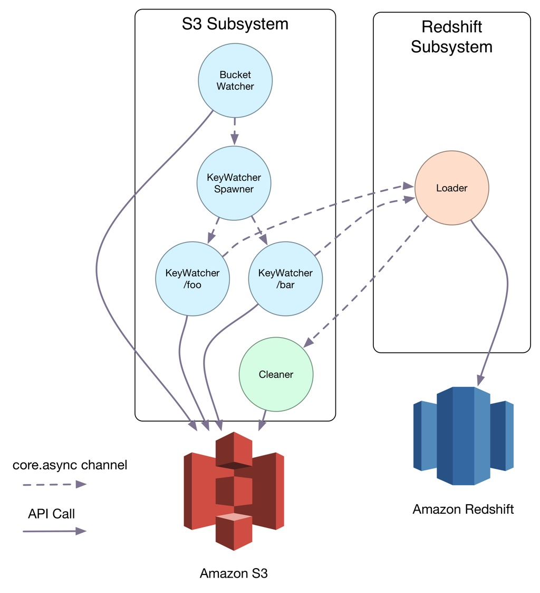

# Design
This is a rough outline for how the system works to make it easier to understand the code.

Blueshift is implemented using Stuart Sierra's [component library](https://github.com/stuartsierra/component) and is separated into 2 subsystems: 1) for interacting with S3, and 2) for importing to Redshift. These systems are connected together using [core.async](https://github.com/clojure/core.async) channels.

The subsystems contain a bunch of processes that communicate to help get the work done, again communicating using `core.async` channels. The figure below helps to visualise this interaction:



## S3 Subsystem
The S3 subsystem is the more complicated of the two. A `BucketWatcher` process periodically lists the contents of the nominated S3 bucket and extracts leaf directories. In the tree below, these would be `directory-a/foo/` and `directory-b/`

      bucket
      ├── directory-a
      │   └── foo
      │       └── manifest.edn
      └── directory-b
          └── manifest.edn

The `BucketWatcher` sends the newly found directories to `KeyWatcherSpawner` to create a process that can monitor for new data files: each directory is watched by its own `KeyWatcher` process.

The `KeyWatcher` process periodically checks for data files inside its directory and a `manifest.edn` file: a *Table Manifest* that tells Blueshift how to interpret the contents of the data files within the directory.

The Table Manifest is an EDN file that must contain something like this:

    {:table        "testing"
     :pk-columns   ["foo"]
     :columns      ["foo" "bar"]
     :jdbc-url     "jdbc:postgresql://foo.eu-west-1.redshift.amazonaws.com:5439/db?tcpKeepAlive=true&user=user&password=pwd"
     :options      ["DELIMITER '\\t'" "IGNOREHEADER 1" "ESCAPE" "TRIMBLANKS"]
     :data-pattern ".*tsv$"}

Most of it is self-explanatory, but there are a few noteworthy values:

* `:options` is a set of strings that will be used with the `COPY` statement on Redshift and can control delimiters, how to interpret blanks etc. 
* `:data-pattern` is a regular expression used to identify the data files you wish to import, each of these files must have the same structure and contain all columns listed (in the same order) as `:columns`.
* `:pk-columns` is used to provide merge upsert behaviour; during the import data is first loaded into a temporary staging table. Any records in the target table that exist in the staging table (as identified by their primary key) will be deleted.

If `KeyWatcher` finds both a *Table Manifest* and a set of files matching the `:data-pattern` it communicates with the Redshift Subsystem's `Loader` process to initiate the load. It does this by sending a message through a [core.async](https://github.com/clojure/core.async) channel which is then consumed by the Redshift subsystem's `Loader` process.

The cleaner process is triggered upon a successful import to Redshift and deletes any files that were imported. The manifest remains in-place ready for new data files to be uploaded.

## Redshift Subsystem
The purpose of the Redshift subsystem is to manage the ingestion of data from S3 into Redshift.

There is a single `Loader` process that uses the *Table Manifest* and a list of files to execute the import. When it receives a message to trigger an import it creates a [*Redshift Copy Manifest* that contains a mandatory list of S3 URLs to load](http://docs.aws.amazon.com/redshift/latest/dg/loading-data-files-using-manifest.html). Once this has been written to S3 the process continues to create a JDBC connection to manage the [upsert operation](http://docs.aws.amazon.com/redshift/latest/dg/merge-replacing-existing-rows.html)

1. Create a temporary staging table `LIKE` the target table (with the same columns, sort keys, distribution keys, primary keys and defaults).
2. Load data from S3 into the staging table
3. Delete any rows from the target table that exist in the staging table (as identified by matching primary key(s))
4. Insert data from the staging table into the target table.
5. Delete the temporary staging table

Upon the transaction being committed the auto-generated *Redshift Copy Manifest* is deleted and the Redshift Subsystem communicates back to the S3 Subsystem that it can clean-up (by deleting the imported data files).

## Interactive Development

The project includes a `user` namespace in `./dev/user.clj`, this is added as a source path for the development profile in Leiningen. Because component allows the graceful stopping and starting of components, we can create a CIDER session in Emacs and use a keybinding (perhaps `command-r`) to stop and start the whole system. 

```elisp
(defun cider-system-reset ()
  (interactive)
  (cider-interactive-eval
   "(user/reset)"))

(define-key clojure-mode-map (kbd "s-r") 'cider-system-reset)
```